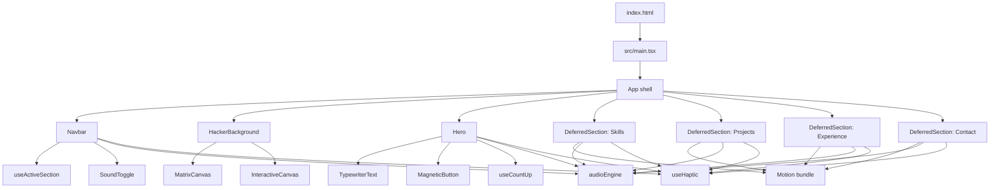

# Architecture Guide

This document describes how the portfolio is assembled at runtime and why its loading, motion, feedback, and accessibility systems are structured as they are. It is the primary reference for changes that affect more than a single content block.

## Architectural intent

The application is a **static, single-page portfolio** optimized around three complementary requirements: a distinctive retro-terminal brand, instant access to the first viewport, and an experience that remains usable when a visitor prefers reduced motion or lacks advanced browser APIs.

The core rule is simple: **the hero must be ready without downloading or executing the lower-section animation workload**. The page therefore renders an immediate terminal shell, navigation, and hero, then progressively activates the remainder of the experience as the visitor scrolls.

## Runtime map

The application entry and document metadata live in [`index.html`](../index.html). React is mounted from [`src/main.tsx`](../src/main.tsx), while [`src/App.tsx`](../src/App.tsx) creates the visible terminal frame and places the internal scrollable `main` region above the decorative background layers.

## Application shell and section lifecycle

The main scroll container is a vertical CSS scroll-snap region. It presents the hero immediately and gives every subsequent page segment a full-height snap slot. A deferred section initially renders only an empty semantic placeholder with the target section ID; this preserves navigation targets and scroll geometry before its JavaScript, DOM, images, and Motion variants exist.

When the placeholder intersects the `main` scroll root, [`DeferredSection`](../src/components/DeferredSection.tsx) sets its internal `ready` state and disconnects the observer. The associated lazy component is then resolved through React `Suspense`. This model has two important consequences:

| Design choice | Benefit | Constraint for future changes |
|---|---|---|
| Full-height placeholder before loading | Scroll snap and deep navigation retain stable geometry. | Do not remove `h-full`, `flex-shrink-0`, or section IDs from the placeholder. |
| Local intersection root | Sections activate only within the terminal’s scroll container, not merely when the browser page itself scrolls. | Keep the `main` container as the nearest scroll root or revise the observer deliberately. |
| One-way readiness | Previously reached sections stay rendered and need no repeat network work. | Treat a section as persistent after first entry; clean up its own listeners on unmount only. |
| Dynamic imports at module scope | The initial route avoids lower-section code and Motion until it is needed. | Keep new heavy presentation sections behind `lazy` + `DeferredSection` unless they are essential above the fold. |

React’s `lazy` API defers component code until the component first renders, and `Suspense` supplies the fallback boundary used here. [1]

## Component responsibilities

| Module | Responsibility | Key maintenance notes |
|---|---|---|
| [`App.tsx`](../src/App.tsx) | Creates the outer terminal shell, scroll container, eager hero, deferred sections, and footer. | Preserve z-index ordering: content must remain above background and below noninteractive CRT overlays. |
| [`Navbar.tsx`](../src/components/Navbar.tsx) | Anchored navigation, active state, scanline transition, and feedback controls. | Uses active-section tracking that must tolerate sections mounting after page load. |
| [`Hero.tsx`](../src/components/Hero.tsx) | Primary identity, hero calls to action, count-up badge, and CSS-first entrance treatment. | Hero slot reservations are intentional stability safeguards, especially on mobile. |
| [`TypewriterText.tsx`](../src/components/TypewriterText.tsx) | Types copy while reserving the final line’s footprint. | Do not replace the measurement span with an unreserved text node or CLS will regress. |
| [`Skills.tsx`](../src/components/Skills.tsx) | Technical capability groups and skill-level display. | Loaded only when first needed; animation belongs in the deferred path. |
| [`Projects.tsx`](../src/components/Projects.tsx) | Selected work and project links. | Replace placeholder destinations with verified public URLs. |
| [`Experience.tsx`](../src/components/Experience.tsx) | Career timeline. | Timeline draw animation must retain a reduced-motion equivalent. |
| [`Contact.tsx`](../src/components/Contact.tsx) | Direct channels and optional Web3Forms submission. | Keep labels, required attributes, and the live status region aligned with visual form changes. |
| [`HackerBackground.tsx`](../src/components/HackerBackground.tsx) | Hosts decorative canvas layers inside the terminal screen. | This layer must remain noninteractive from an accessibility and pointer-events perspective. |
| [`MatrixCanvas.tsx`](../src/components/MatrixCanvas.tsx) | Low-rate falling character effect. | It must pause while hidden and when reduced motion is requested. |
| [`InteractiveCanvas.tsx`](../src/components/InteractiveCanvas.tsx) | Pointer-responsive particles and cursor trail. | It must remain idle without pointer activity and never capture input events. |
| [`SoundToggle.tsx`](../src/components/SoundToggle.tsx) | Visitor-controlled audio setting. | Audio starts disabled and the stored preference is respected. |
| [`MagneticButton.tsx`](../src/components/MagneticButton.tsx) | Desktop pointer attraction for selected actions. | Provide a normal focus and touch experience; do not make success depend on pointer precision. |
| [`ScanlineWipe.tsx`](../src/components/ScanlineWipe.tsx) | Brief navigation transition layer. | Decorative motion only; it must yield to reduced-motion behavior. |

## State and browser APIs

The application deliberately avoids a global state library. State is local to the component that owns it, or represented by one focused hook.

| API or hook | Used for | Failure behavior |
|---|---|---|
| `IntersectionObserver` | Deferred sections and active-section tracking. | Sections still render when their component becomes ready; browsers without support should receive a simple, testable fallback if support becomes a product requirement. |
| `MutationObserver` | Reconnects active-section observation after lazy sections mount. | Navigation remains usable even if visual active tracking becomes unavailable. |
| `requestAnimationFrame` | Canvas rendering and numeric count-up. | Rendering is cancelled during cleanup or inactivity. |
| `document.visibilityState` | Pauses background rendering in hidden tabs. | The decorative system simply remains paused. |
| `matchMedia('(prefers-reduced-motion: reduce)')` | Disables nonessential motion. | The visual experience becomes static without losing content or actions. |
| Web Audio API | Synthesizes terminal ticks, confirmations, and status sounds. | No audio is played until enabled; unsupported browsers remain silent. |
| Vibration API | Adds short optional haptic patterns. | Calls are safe no-ops where unsupported. |
| `localStorage` | Persists the sound preference. | The default is silent if storage cannot be read or written. |

## Performance design

### Initial-route budget

The first visible route is intentionally limited to the application shell, navigation, hero, fonts, critical CSS, and the passive background hosts. The animation library is split into a separate vendor chunk, and lower section modules load after their slots enter the viewport.

| Optimization | Where it is implemented | Rationale |
|---|---|---|
| Manual vendor chunks | [`vite.config.ts`](../vite.config.ts) | Separates React and the Motion runtime from the initial bundle. |
| Lazy portfolio sections | [`App.tsx`](../src/App.tsx) and [`DeferredSection.tsx`](../src/components/DeferredSection.tsx) | Defers below-the-fold script, DOM, images, and in-view animation. |
| CSS-first hero | [`Hero.tsx`](../src/components/Hero.tsx) and [`index.css`](../src/index.css) | Avoids requiring the Motion runtime for first-paint entrance treatment. |
| Self-hosted fonts | [`public/fonts/`](../public/fonts/) and [`index.html`](../index.html) | Removes an external font request from the critical path. |
| Layout reservations | [`TypewriterText.tsx`](../src/components/TypewriterText.tsx) and [`index.css`](../src/index.css) | Prevents copy progression and hero sequencing from moving rendered content. |
| Idle-aware canvases | [`MatrixCanvas.tsx`](../src/components/MatrixCanvas.tsx) and [`InteractiveCanvas.tsx`](../src/components/InteractiveCanvas.tsx) | Keeps decoration from producing needless work when it cannot be seen or has nothing to react to. |

### Current regression baseline

The project keeps Lighthouse outputs locally for investigation. They are development artifacts, not user-facing deploy assets. After the final hero-reservation work, the relevant audits recorded the following lab values:

| Profile | Performance | FCP | LCP | TBT | CLS |
|---|---:|---:|---:|---:|---:|
| Desktop | 96 | 1.3 s | 2.3 s | 80 ms | 0.043 |
| Mobile 360 × 800 | 88 | 2.2 s | 2.5 s | 30 ms | 0.068 |
| Mobile 412 × 915 | 92 | 1.9 s | 2.2 s | 70 ms | 0.043 |

These are point-in-time lab measurements. For real production quality, monitor the Core Web Vitals field metrics: LCP, INP, and CLS. Google defines the “good” thresholds as LCP at or below 2.5 seconds, INP at or below 200 milliseconds, and CLS at or below 0.1 for the 75th percentile of page views. [2]

> **Do not optimize only for the score.** The terminal boot sequence reveals content progressively by design, which can make Speed Index appear slower than the page’s LCP and interaction metrics. Preserve this effect unless a product decision favors a more immediate visual reveal.

## Motion, feedback, and preference contract

The interactive treatment is optional enhancement. Every addition must preserve a successful path through the site with no animation, no sound, no vibration, and no pointer hover.

1. **Reduced motion is authoritative.** New CSS keyframes, Motion variants, canvas loops, or media must deactivate or simplify when the visitor requests reduced motion.
2. **Sound begins off.** `audioEngine` must not initialize audible output before the visitor enables sound through `SoundToggle`.
3. **Haptics are enhancement only.** `useHaptic` must never block action completion or display an error on unsupported devices.
4. **Canvas is decorative.** Background canvases must use `pointer-events: none`, cannot contain information needed to use the site, and must be cancellable.
5. **Keyboard focus remains visible.** Glitch effects, magnetic buttons, and scanline transitions must not obscure the active element’s focus treatment.

The CSS `prefers-reduced-motion` media feature is the browser-provided mechanism for adapting a user interface when a user has requested less nonessential motion. [3]

## Metadata, assets, and SEO

[`index.html`](../index.html) owns document-level details that must be correct before the React application starts: language, viewport, title, description, canonical URL, social preview metadata, preloaded self-hosted fonts, and a JSON-LD Person schema. Keep metadata changes intentional and verify the final generated HTML with a production build.

| Asset or configuration | Purpose | Change guidance |
|---|---|---|
| `public/CNAME` | Connects the Pages artifact to the custom domain. | Keep the domain value exact; change the GitHub Pages domain settings in tandem. |
| `public/fonts/` | Stores local font files used by the terminal visual system. | Use WOFF2, preserve preload references, and verify available character coverage. |
| `public/andriikozakov.pdf` | Public downloadable CV. | Replace deliberately and retain the expected filename if hero links use it. |
| `public/avatar.webp` | Hero portrait asset. | The existing file is corrupted; replace it with a valid optimized image before relying on it in the UI. |
| `public/favicon.svg` | Browser and bookmark icon. | Validate contrast and rendering at small sizes after editing. |

## Change-impact checklist

| If you change… | Also verify… |
|---|---|
| Hero copy, typewriter timing, or CTA layout | Mobile CLS at 360 px and 412 px, line wrapping, reduced motion, and keyboard focus. |
| Navigation items or section IDs | `useActiveSection`, anchor targets, deferred placeholders, and the footer’s snap position. |
| Motion variants or canvas effects | Reduced-motion behavior, hidden-tab pausing, CPU usage, and initial bundle size. |
| Project content or new external links | Accessible link names, `target="_blank"` safety attributes, destination validity, and mobile wrapping. |
| Contact fields or feedback | Labels, browser validation, `aria-live` messaging, failure state, and Web3Forms payload fields. |
| Fonts, images, or other media | Font/image sizing, preloads, source licensing, Lighthouse results, and screen-reader alternatives. |
| Vite output behavior | `npm run lint`, `npm run build`, deploy artifact contents, and a production preview. |

## References

[1]: https://react.dev/reference/react/lazy "React lazy"
[2]: https://web.dev/articles/vitals "Web Vitals"
[3]: https://developer.mozilla.org/docs/Web/CSS/@media/prefers-reduced-motion "MDN: prefers-reduced-motion"
